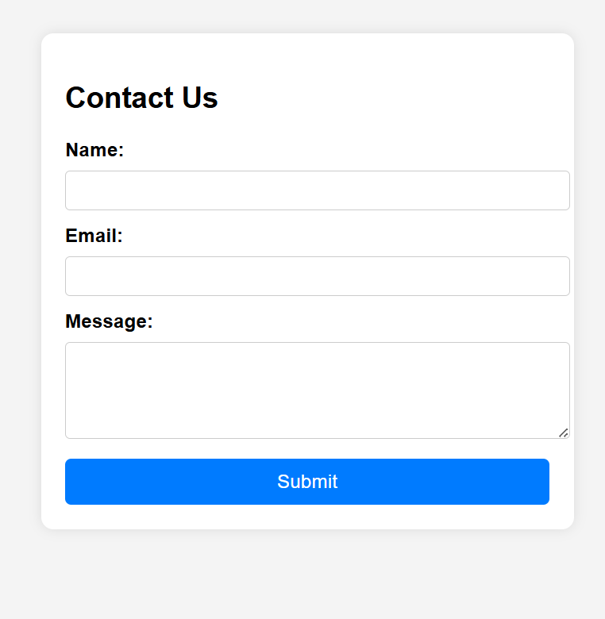
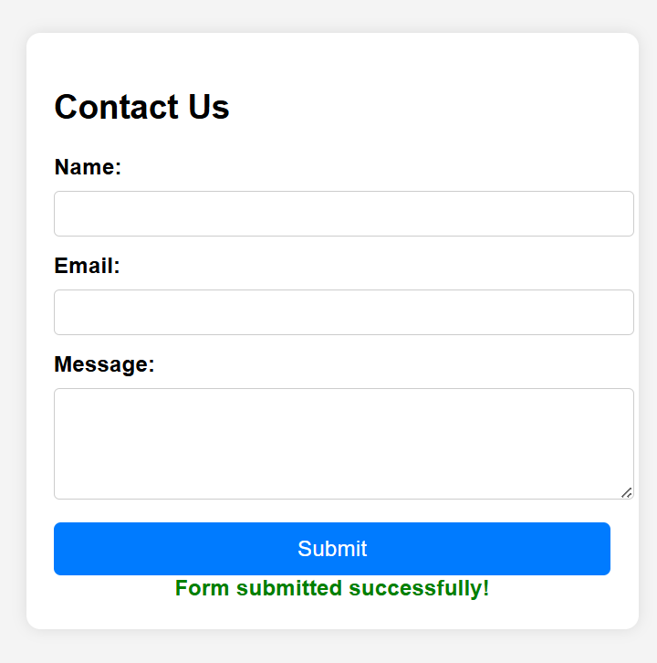

# 📝 Contact Form with JavaScript Validation

## 🚀 Objective
Build a simple contact form that performs **client-side validation** using **JavaScript** to ensure proper user input.

## 📸 Display

| Display Form | Process Structure |
|------------|----------------|
|  |  |

## 🔧 Tools Used
- **Visual Studio Code (VS Code)** – Code Editor  
- **Chrome Browser** – Testing & Debugging

## 🧱 Features
- Input fields: `Name`, `Email`, `Message`
- Real-time validation using JavaScript
- Error messages shown below invalid fields
- Email validated using **Regular Expressions**
- Success message on valid input
- Responsive and styled with basic **CSS**
- Prevents form submission if invalid

## 📂 Project Structure

contact-form/
├── index.html # Main form with embedded CSS and JavaScript
└── README.md # Project overview and documentation

## 📸 Screenshots

| Valid Form | Error Messages |
|------------|----------------|
|  |  |

## 🔍 How It Works

### ✅ Validation Rules
- **Name**: Cannot be empty
- **Email**: Must follow proper email format (regex checked)
- **Message**: Cannot be empty

### 🔁 Behavior
- Shows error messages near inputs
- Stops submission using `event.preventDefault()`
- Shows success message on valid input
- Uses `form.reset()` after success

## 🛡️ Security Tips
- Always **sanitize inputs** even if validated on client-side
- Use **server-side validation** for real-world apps
- Escape content to prevent **XSS attacks**

## 📦 Future Improvements
- Add backend using PHP/Node.js to store or send emails
- Real-time validation while typing
- Use localStorage to save input temporarily
- Add ARIA roles for accessibility

## 👨‍💻 Author
**Dondapati Theerdha Purushotham**  
🧠 Learning Web & AI Development  
🎯 Passionate about Smart and Secure Applications

## ✅ License
Free to use for learning and academic purposes.